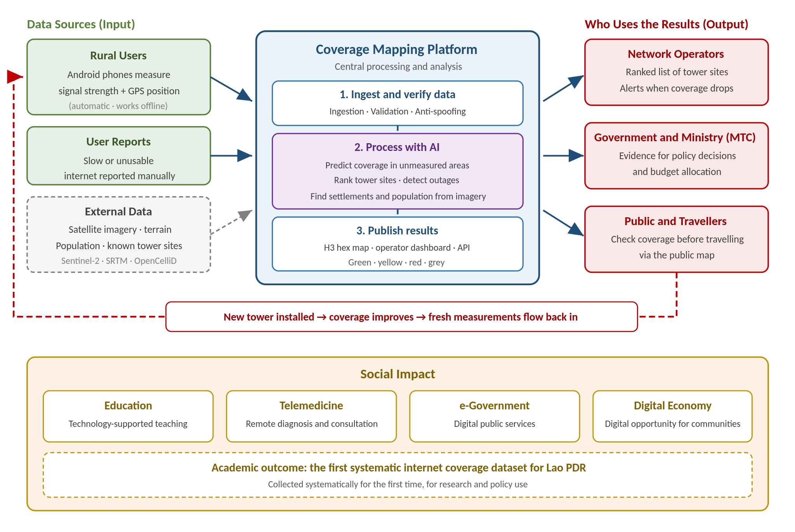
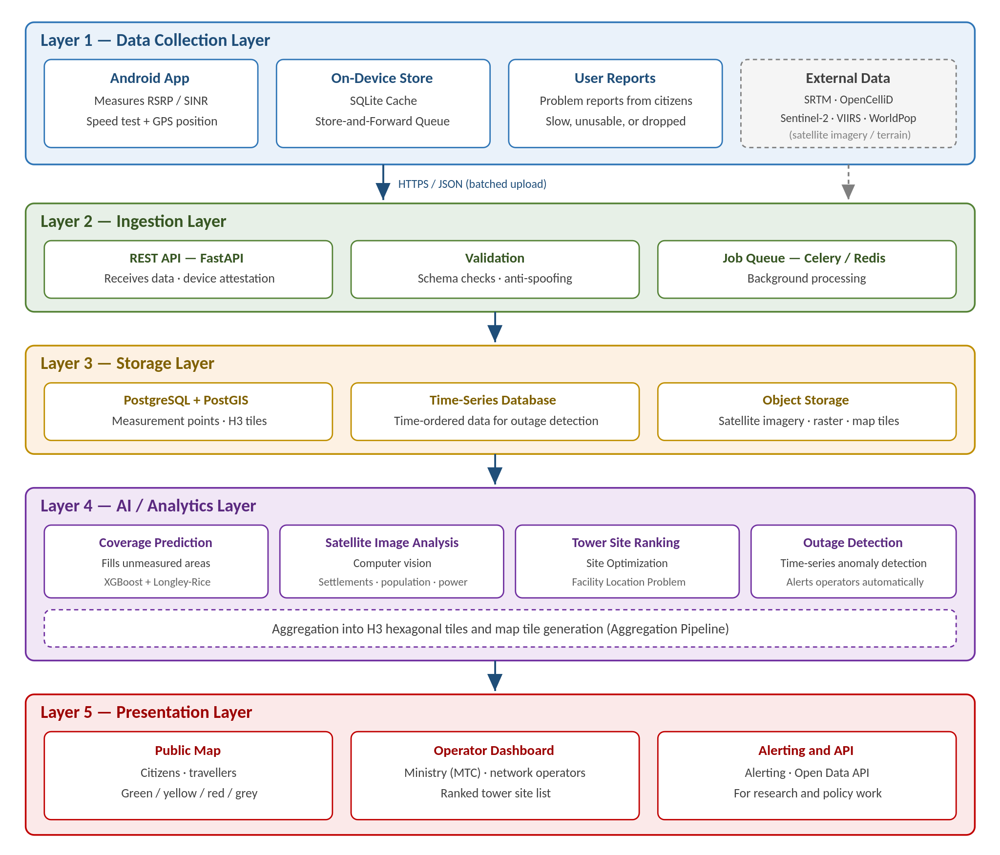

# Competition Project Proposal — spec of record

**AI-Powered National Internet Coverage Mapping Platform**
English version, translated from the Lao original. Source: `docs/Competition-Project-Proposal-EN.docx`.

This markdown copy is the working reference for implementation. If code and proposal disagree, the proposal wins unless the disagreement is recorded in `docs/decisions.md`.

## 1. The Problem

Many areas across Laos still do not receive adequate internet coverage, which delays access to technology for the communities living there.

Schools are affected most visibly: many are unable to integrate technology into their teaching, leaving students in rural districts to adapt to the digital world far more slowly than they should.

Beyond this, the root problem is that no reliable evidence exists about which areas lack coverage, or by how much. Network expansion is therefore planned largely on estimates rather than on real measurement.

## 2. Proposed Solution

### 2.1 Overall Concept

A mobile application together with a backend system that uses artificial intelligence to build a national internet coverage quality map.

The primary data does not come from operator estimates or marketing coverage maps. It comes from real field measurements collected through users' phones across the country (crowdsourced measurement) — the only method that reflects what rural communities actually experience.

### 2.2 How Data Is Collected

Collected automatically through the Android telephony API:

| Data collected | Detail |
| --- | --- |
| Signal strength | RSRP, RSRQ, SINR |
| Network type | 2G / 3G / 4G / 5G |
| Operator | The network currently connected |
| Service quality | Download / upload speed and latency |
| Position and time | GPS coordinates and measurement timestamp |

Phase 1 targets Android only, because iOS severely restricts access to signal-strength data.

### 2.3 Operating Where There Is No Coverage (Store-and-Forward)

The core of the design. In an area with no internet the app cannot upload immediately, so it:

- Records each measurement locally with its coordinates and timestamp
- Uploads automatically once the user returns to an area with coverage

Places with "no signal at all" therefore become the most valuable data in the system, rather than blank gaps on the map.

#### Why measurement is possible without internet

Measuring the signal and using the internet are two separate things. The phone's modem scans for base stations continuously, whether or not data is being transmitted. Even where the internet is unusable, the app can still read the radio state through Android's `ServiceState` and `getAllCellInfo()`.

GPS works without any network, because it receives one-way signals from satellites. A-GPS only speeds up the initial position fix.

The system distinguishes five states rather than a simple "signal / no signal":

| Radio state | Meaning | Map colour |
| --- | --- | --- |
| No cell detected at all | No network reaches this area — a new tower is required | Red |
| Cells visible but registration fails | Signal exists but is too weak to use (emergency calls only) | Red-orange |
| Registered on 2G/3G only | Calls and SMS work, data does not | Orange |
| 4G/LTE with weak signal | Data works but is slow (RSRP below −110 dBm) | Yellow |
| 4G/LTE with good signal | Normal usable service | Green |

This distinction carries real policy weight: an area no tower reaches at all requires investment in a new site, whereas an area that has a tower but a weak signal may be solved by equipment upgrades or a repeater, at far lower cost.

#### Two levels of measurement

- **Passive**: RSRP, RSRQ, SINR, cell IDs and network type — collectable anywhere, even with no internet, and cheap on battery
- **Active**: download speed and latency — possible only where the internet is usable

Points carrying both levels train a model of the relationship between RSRP and real throughput; that relationship is then applied to estimate speed at the radio-only points.

Android's `WorkManager` with a `NetworkType.CONNECTED` constraint handles deferred uploads. A sampling rule (one record per 100 m or per 60 seconds) and a queue cap prevent excessive use of device storage.

#### A limitation we accept openly

The system only learns about places people actually travel to. A village with no traffic produces no data. Partnering with regular collectors — bus drivers, health workers on field visits, provincial staff and teachers — therefore matters more to map coverage than the app's own features do.

### 2.4 Map Presentation

All data is aggregated into a hexagonal grid (H3) rather than displayed as individual points, both to protect user privacy and to keep the map readable:

- **Green**: fast and stable internet access
- **Yellow**: signal present but slow or unstable
- **Red**: no internet access
- **Grey**: not yet measured (to be estimated by the AI model described in 2.5)

### 2.5 The Role of Artificial Intelligence

**(1) Coverage Prediction.** Measurements exist only along routes people travel. AI fills the gaps by training on the real measurement points, terrain elevation (SRTM DEM), land cover and population density, and distance from known tower sites (OpenCelliD). Combined with a radio propagation model (Longley-Rice / Okumura-Hata) as a physical baseline, so that predictions remain credible.

**(2) Satellite Image Analysis (Computer Vision).** Satellite imagery and nighttime lights are used to detect the location and extent of villages and settlements, estimate population where census data is out of date, and assess electrification (a prerequisite for installing a tower).

**(3) Tower Site Ranking (Site Optimization).** A facility location problem: compute the sites that cover the largest population per tower and present them to operators as a prioritised list.

**(4) Outage Detection (Anomaly Detection).** Time-series analysis alerts operators when signal quality in an area degrades abnormally or disappears.

### 2.6 The User's Side

- **Report a problem**: users report slow or unusable internet, forwarded to the service provider
- **Check before travelling**: view the map in advance to see whether a destination has coverage
- **Privacy protection**: location data is anonymised and aggregated into grid tiles before any display

### 2.7 How the Data Is Used

- **Channel 1 — Government and operators**: real evidence for the Ministry of Technology and Communications and domestic network operators, so tower expansion is planned where it is genuinely needed and delivers value for the investment.
- **Channel 2 — Citizens and travellers**: a tool for the public, students and travellers to plan journeys and remote work in advance.

### 2.8 Pilot Scope

Phase 1:

- Build the Android collection app and the backend (FastAPI + PostGIS)
- Collect real measurements along the main routes of one target province
- Train an AI model to predict coverage for the unmeasured areas
- Present the map and a ranked list of tower sites worth funding first

## 3. System Architecture

*Figure 1: System overview.* The critical element is the feedback loop (red dashed line): once an operator acts on the data and installs a tower, coverage in that area improves, and fresh measurements flow back into the system. The map stays current, and the investment is demonstrably proven to have worked.

*Figure 2: Five-layer technical architecture.*

### 3.3 Responsibilities by Layer

| Layer | Main responsibility | Technology used |
| --- | --- | --- |
| Layer 1 Data Collection | Measure signal from real devices, receive user reports, import external datasets | Android (Kotlin), SQLite, SRTM, OpenCelliD, Sentinel-2 |
| Layer 2 Ingestion | Receive data, verify device identity, validate records, queue processing jobs | FastAPI, Pydantic, Celery, Redis |
| Layer 3 Storage | Store measurement points, H3 tiles, time-series data and satellite imagery | PostgreSQL + PostGIS, TimescaleDB, MinIO / S3 |
| Layer 4 AI / Analytics | Predict coverage, analyse satellite imagery, rank tower sites, detect outages | Python, XGBoost, PyTorch, H3, SPLAT! / Longley-Rice |
| Layer 5 Presentation | Serve the public map, the operator dashboard and the alerting system | MapLibre GL, React, REST / Open Data API |

### 3.4 Data Flow

1. The app measures signal quality and records it locally with coordinates and time
2. On returning to coverage, records are uploaded in batches over HTTPS
3. The system validates records and rejects spoofed data before writing to PostGIS
4. Background jobs aggregate data into H3 tiles and retrain the AI models
5. Results are rendered as map tiles and a ranked list of candidate tower sites
6. The public views the map; operators and government access the dashboard or API

### 3.5 Security and Data Protection

- All data transmission is encrypted with TLS/HTTPS
- Device attestation and rate limiting guard against fabricated submissions
- Location data is anonymised and aggregated into tiles before any display
- Access is separated between the public, operators and government (role-based access control)

#### Verifying the trustworthiness of delayed data

Because data from uncovered areas is uploaded hours after capture, it is inherently easier to forge. Three measures:

- **Sign at capture time**: each record is signed with a device key the moment it is measured, not at upload
- **Record visible cell IDs**: hard to fabricate plausibly, so they can be cross-checked against the reported position
- **Check trajectory plausibility**: verify that travel from the measurement point to the upload point is physically possible

Without these, anyone could submit false data to make their own area appear underserved and jump the investment queue.

## 4. Expected Outcomes

Operators and government receive real evidence of rural communities' demand for internet access, so that every rural area can achieve coverage and move into the digital era together.

The platform also underpins:

- **Education**: technology-integrated teaching in rural schools
- **Telemedicine**: remote diagnosis and consultation in isolated areas
- **e-Government**: digital public services at the grassroots
- **Digital economy**: digital economic opportunity for communities

Academically, a further outcome is the first systematically collected internet coverage quality dataset for Lao PDR, supporting research and policy-making well beyond the life of this project.
